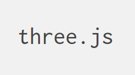

<!-- .slide: data-background="media/img/TACC.jpeg" -->

<div class="talk-title">
  <h1>A-Frame</h1>
  <p>A web framework for building VR experiences<sup class="reference">[1][2]</sup></p>
  <p class="talk-info">
    Brian McCann Ph.D. | Texas Advanced Computing Center
    Andrew Solis | Texas Advanced Computing Center
  </p>
</div>

<!-- NOTES -->
- Onboard web developers into the 3D and VR world with easy-to-use tools
- Prototype WebVR experiences faster
- Slides taken from aframe, if you like to see original slides

------

# Virtual Reality

<!-- .slide: data-background-video="media/video/virtualreality.mp4" data-background-video-loop="true" data-background-video-muted="true" data-state="state--bg-dark" -->

<!-- NOTES -->
- Ask how many have tried VR.
- Virtual reality is a technology platform that transports you to realistic, immersive 3D environments 
- users can interact both with the environment and content 
- a growing platform that has the ability to change how we work + play + communicate digitally, face of society

---

<div class="image-row">
  <div></div>
  <div></div>
  <div></div>
</div>

<div class="image-row">
  <div></div>
  <div></div>
  <div></div>
</div>

<!-- NOTES -->
- Backed by the largest corporations in the world, everyone wants in
- Range from cheap to expensive, tethered and untethered, controllers, tracking
- HTC Vive with Steam currently offers the most compelling experiences, but never know
- See a lot of different devices, systems, platforms competing against each other...

---

## Friction of VR Ecosystems

<div class="captioned-image-row">
  <div>
    
    <i>Gatekeepers</i>
  </div>
  <div>
    
    <i>Installs</i>
  </div>
  <div>
    
    <i>Closed</i>
  </div>
</div>

<!-- NOTES -->
- App stores and corporations control distribution: can take down or block content
- Downloads / installs are a barrier to consumption: small business pages
- Closed ecosystem: proprietary engines, steep learning curves, isolated experiences, fragmentation
- We want VR to be successful, so we want a platform without these points of friction. 

------

# WebVR

An open virtual reality platform with the advantages of **the Web**

<div class="captioned-image-row">
  <div>
    
    <i>Open</i>
  </div>
  <div>
    
    <i>Connected</i>
  </div>
  <div>
    
    <i>Instant</i>
  </div>
</div>

<!-- NOTES -->
WebVR is...virtual reality in the browser, powered by the Internet

Open:
- Anyone can publish
- Open source culture with open standards

Connected:
- Traverse worlds

Instant:
- Click a link on Twitter or Weibo, immediate VR experiences
- No installs
---

##Goals <sup class="reference">[3]</sup>

* Detect available Virtual Reality devices
* Query the devices capabilities
* Poll the device’s position and orientation
* Display imagery on the device at the appropriate frame rate

<!-- NOTES -->
- How does WebVR work??
---


Browser APIs that enable WebGL rendering to headsets and access to VR
sensors

https://w3c.github.io/webvr/

<!-- NOTES -->

WebGL: 
- A JavaScript API for rendering interactive 3D and 2D graphics
  within any compatible web browser


API:
- Optimized rendering path to headsets
- Access position and rotation (pose) data

History:
- Initial WebVR API by Mozilla
- Working W3C community group

Not just a specification, it's implemented...

---

https://webvr.rocks

<div class="captioned-image-row small">
  <div>
    
    <i>Firefox Nightly</i>
  </div>
  <div>
    
    <i>Microsoft Edge</i>
  </div>
  <div>
    
    <i>Chromium</i>
  </div>
</div>

<div class="captioned-image-row small">
  <div>
    
    <i>Chrome for Android</i>
  </div>
  <div>
    
    <i>Oculus Carmel</i>
  </div>
  <div>
    
    <i>Samsung Internet</i>
  </div>
  <div>
    
    <i>Mobile Polyfill</i>
  </div>
</div>

<!-- NOTES -->

- Mozilla, Google, Samsung, Microsoft, community currently iterating WebVR 1.0 API
- Firefox + Chrome WebVR 1.0 hits release channels by early 2017
- Currently behind Nightly, custom builds, and flags
- Mobile Polyfill: use device motion / orientation sensors to polyfill on smartphones
- What is the end goal...

---

## Metaverse

<!-- .slide: data-background="media/img/metaverse.jpg" -->

<!-- NOTES -->
- Metaverse: a shared virtual-reality space where users can interact
  with the virtual envrionment and other users
- Requiring decentralized/open/connected space, the Web is best platform to fully realize
- Where do we begin?

---
## (Possible) Solutions

<div class="captioned-image-row medium">
  <div>
    
  </div>
  <div>
    
  </div>
    <div>
    
  </div>
</div>

<!-- NOTES -->
- WebGL: A JavaScript API for rendering interactive 3D and 2D graphics
  within any compatible web browser 
- three.js: A JavaScript API to create and display 3D computer graphics, that
  is built on top of WebGL
- Unity: Cross-platform game engine primarily aimed for video games and simulations

- You could use native WebGL, but let's see what that requires...

---
## Creating a rotating cube in WebGL<sup class="reference">[4]</sup>
<div class="row-content">
  <div>
    <video data-autoplay loop src="media/video/rotating_cube_webgl.mov"></video>
  </div>
  <div class="code-block">
  <pre> <code class="html">
  <!doctype html>
  <html>
     <body>
        <canvas width = "570" height = "570" id = "my_Canvas"></canvas>

        <script>

           /*============= Creating a canvas =================*/
           var canvas = document.getElementById('my_Canvas');
           gl = canvas.getContext('experimental-webgl');
           
           /*============ Defining and storing the geometry =========*/

           var vertices = [
              -1,-1,-1, 1,-1,-1, 1, 1,-1, -1, 1,-1,
              -1,-1, 1, 1,-1, 1, 1, 1, 1, -1, 1, 1,
              -1,-1,-1, -1, 1,-1, -1, 1, 1, -1,-1, 1,
              1,-1,-1, 1, 1,-1, 1, 1, 1, 1,-1, 1,
              -1,-1,-1, -1,-1, 1, 1,-1, 1, 1,-1,-1,
              -1, 1,-1, -1, 1, 1, 1, 1, 1, 1, 1,-1, 
           ];

           var colors = [
              5,3,7, 5,3,7, 5,3,7, 5,3,7,
              1,1,3, 1,1,3, 1,1,3, 1,1,3,
              0,0,1, 0,0,1, 0,0,1, 0,0,1,
              1,0,0, 1,0,0, 1,0,0, 1,0,0,
              1,1,0, 1,1,0, 1,1,0, 1,1,0,
              0,1,0, 0,1,0, 0,1,0, 0,1,0
           ];

           var indices = [
              0,1,2, 0,2,3, 4,5,6, 4,6,7,
              8,9,10, 8,10,11, 12,13,14, 12,14,15,
              16,17,18, 16,18,19, 20,21,22, 20,22,23 
           ];

           // Create and store data into vertex buffer
           var vertex_buffer = gl.createBuffer ();
           gl.bindBuffer(gl.ARRAY_BUFFER, vertex_buffer);
           gl.bufferData(gl.ARRAY_BUFFER, new Float32Array(vertices), gl.STATIC_DRAW);

           // Create and store data into color buffer
           var color_buffer = gl.createBuffer ();
           gl.bindBuffer(gl.ARRAY_BUFFER, color_buffer);
           gl.bufferData(gl.ARRAY_BUFFER, new Float32Array(colors), gl.STATIC_DRAW);

           // Create and store data into index buffer
           var index_buffer = gl.createBuffer ();
           gl.bindBuffer(gl.ELEMENT_ARRAY_BUFFER, index_buffer);
           gl.bufferData(gl.ELEMENT_ARRAY_BUFFER, new Uint16Array(indices), gl.STATIC_DRAW);
                                                
           /*=================== Shaders =========================*/
           
           var vertCode = 'attribute vec3 position;'+
              'uniform mat4 Pmatrix;'+
              'uniform mat4 Vmatrix;'+
              'uniform mat4 Mmatrix;'+
              'attribute vec3 color;'+//the color of the point
              'varying vec3 vColor;'+
        
              'void main(void) { '+//pre-built function
                 'gl_Position = Pmatrix*Vmatrix*Mmatrix*vec4(position, 1.);'+
                 'vColor = color;'+
              '}';

           var fragCode = 'precision mediump float;'+
              'varying vec3 vColor;'+
              'void main(void) {'+
                 'gl_FragColor = vec4(vColor, 1.);'+
              '}';
           
           var vertShader = gl.createShader(gl.VERTEX_SHADER);
           gl.shaderSource(vertShader, vertCode);
           gl.compileShader(vertShader);

           var fragShader = gl.createShader(gl.FRAGMENT_SHADER);
           gl.shaderSource(fragShader, fragCode);
           gl.compileShader(fragShader);

           var shaderProgram = gl.createProgram();
           gl.attachShader(shaderProgram, vertShader);
           gl.attachShader(shaderProgram, fragShader);
           gl.linkProgram(shaderProgram);

           /* ====== Associating attributes to vertex shader =====*/
           var Pmatrix = gl.getUniformLocation(shaderProgram, "Pmatrix");
           var Vmatrix = gl.getUniformLocation(shaderProgram, "Vmatrix");
           var Mmatrix = gl.getUniformLocation(shaderProgram, "Mmatrix");

           gl.bindBuffer(gl.ARRAY_BUFFER, vertex_buffer);
           var position = gl.getAttribLocation(shaderProgram, "position");
           gl.vertexAttribPointer(position, 3, gl.FLOAT, false,0,0) ;
           
           // Position
           gl.enableVertexAttribArray(position);
           gl.bindBuffer(gl.ARRAY_BUFFER, color_buffer);
           var color = gl.getAttribLocation(shaderProgram, "color");
           gl.vertexAttribPointer(color, 3, gl.FLOAT, false,0,0) ;
           
           // Color
           gl.enableVertexAttribArray(color);
           gl.useProgram(shaderProgram);

           /*==================== MATRIX =====================*/

           function get_projection(angle, a, zMin, zMax) {
              var ang = Math.tan((angle*.5)*Math.PI/180);//angle*.5
              return [
                 0.5/ang, 0 , 0, 0,
                 0, 0.5*a/ang, 0, 0,
                 0, 0, -(zMax+zMin)/(zMax-zMin), -1,
                 0, 0, (-2*zMax*zMin)/(zMax-zMin), 0 
              ];
           }
        
           var proj_matrix = get_projection(40, canvas.width/canvas.height, 1, 100);

           var mov_matrix = [1,0,0,0, 0,1,0,0, 0,0,1,0, 0,0,0,1];
           var view_matrix = [1,0,0,0, 0,1,0,0, 0,0,1,0, 0,0,0,1];

           // translating z
           view_matrix[14] = view_matrix[14]-6;//zoom

           /*==================== Rotation ====================*/

           function rotateZ(m, angle) {
              var c = Math.cos(angle);
              var s = Math.sin(angle);
              var mv0 = m[0], mv4 = m[4], mv8 = m[8];
          
              m[0] = c*m[0]-s*m[1];
              m[4] = c*m[4]-s*m[5];
              m[8] = c*m[8]-s*m[9];

              m[1]=c*m[1]+s*mv0;
              m[5]=c*m[5]+s*mv4;
              m[9]=c*m[9]+s*mv8;
           }

           function rotateX(m, angle) {
              var c = Math.cos(angle);
              var s = Math.sin(angle);
              var mv1 = m[1], mv5 = m[5], mv9 = m[9];
          
              m[1] = m[1]*c-m[2]*s;
              m[5] = m[5]*c-m[6]*s;
              m[9] = m[9]*c-m[10]*s;

              m[2] = m[2]*c+mv1*s;
              m[6] = m[6]*c+mv5*s;
              m[10] = m[10]*c+mv9*s;
           }

           function rotateY(m, angle) {
              var c = Math.cos(angle);
              var s = Math.sin(angle);
              var mv0 = m[0], mv4 = m[4], mv8 = m[8];
          
              m[0] = c*m[0]+s*m[2];
              m[4] = c*m[4]+s*m[6];
              m[8] = c*m[8]+s*m[10];

              m[2] = c*m[2]-s*mv0;
              m[6] = c*m[6]-s*mv4;
              m[10] = c*m[10]-s*mv8;
           }

           /*================= Drawing ===========================*/
           var time_old = 0;
        
           var animate = function(time) {

              var dt = time-time_old;
              rotateZ(mov_matrix, dt*0.005);//time
              rotateY(mov_matrix, dt*0.002);
              rotateX(mov_matrix, dt*0.003);
              time_old = time;

              gl.enable(gl.DEPTH_TEST);
              gl.depthFunc(gl.LEQUAL);
              gl.clearColor(0.5, 0.5, 0.5, 0.9);
              gl.clearDepth(1.0);

              gl.viewport(0.0, 0.0, canvas.width, canvas.height);
              gl.clear(gl.COLOR_BUFFER_BIT | gl.DEPTH_BUFFER_BIT);
              gl.uniformMatrix4fv(Pmatrix, false, proj_matrix);
              gl.uniformMatrix4fv(Vmatrix, false, view_matrix);
              gl.uniformMatrix4fv(Mmatrix, false, mov_matrix);
              gl.bindBuffer(gl.ELEMENT_ARRAY_BUFFER, index_buffer);
              gl.drawElements(gl.TRIANGLES, indices.length, gl.UNSIGNED_SHORT, 0);
          
              window.requestAnimationFrame(animate);
           }
           animate(0);
        
        </script>

     </body>
  </html>
  </code></pre>  
  </div>
</div>

<!-- NOTES -->
- A lot of graphics programming
- Screen Buffer, Matrices (Model, View, Projection)
- What about Three.JS?
---

## Creating a rotating cube in Three.JS<sup class="reference">[5]</sup>
<div class="row-content">
  <div>
    <video data-autoplay loop src="media/video/rotating_cube_threejs.mov"></video>
  </div>
  <div class="code-block">
    <pre> <code class="html">
      <!doctype html>
      <html>
      <head>
          <title>Rotating logo - WebGL experiment</title>
      </head>
      <body>
          <div id="container"></div>
          <script src="js/three.min.js"></script>
          <script type="text/javascript">
            
            var scene, camera, renderer;

            var WIDTH  = window.innerWidth;
            var HEIGHT = window.innerHeight;

            var SPEED = 0.01;

            function init() {
                scene = new THREE.Scene();

                initCube();
                initCamera();
                initRenderer();

                document.body.appendChild(renderer.domElement);
            }

            function initCamera() {
                camera = new THREE.PerspectiveCamera(70, WIDTH / HEIGHT, 1, 10);
                camera.position.set(0, 3.5, 5);
                camera.lookAt(scene.position);
            }

            function initRenderer() {
                renderer = new THREE.WebGLRenderer({ antialias: true });
                renderer.setSize(WIDTH, HEIGHT);
            }

            function initCube() {
                cube = new THREE.Mesh(new THREE.CubeGeometry(2, 2, 2), new THREE.MeshNormalMaterial());
                scene.add(cube);
            }

            function rotateCube() {
                cube.rotation.x -= SPEED * 2;
                cube.rotation.y -= SPEED;
                cube.rotation.z -= SPEED * 3;
            }

            function render() {
                requestAnimationFrame(render);
                rotateCube();
                renderer.render(scene, camera);
            }

            init();
            render();

          </script>
      </body>
      </html>
    </code></pre>  
  </div>
</div>

<!-- NOTES -->
- Easier to understand, but still a bit heavy
- Still need to setup scene before setting up content
---

<!-- .slide: data-background-video="media/video/boilerplate.mp4" data-state="state--bg-dark" data-background-video-loop="true"-->

<div class="slide__boilerplate">
  <p>Import WebVR polyfill</p>
  <p>Set up camera</p>
  <p>Set up lights</p>
  <p>Initialize scene</p>
  <p>Declare and pass canvas</p>
  <p>Listen to window resize</p>
  <p>Install VREffect</p>
  <p>Instantiate renderer</p>
  <p>Create render loop</p>
  <p>Preload assets</p>
  <p>Figure out responsiveness</p>
  <p>Deal with metatags and mobile</p>
</div>

<!-- NOTES -->
- It's still too difficult to create WebVR experiences
- Huge obstacle if doing small prototypes and experiments
- Boilerplate needs updating with new versions of WebVR, three.js, and browser quirks
- Encapsulate all of that into one line...

------

# A-Frame

<!-- .slide: data-background="media/img/aframe-rendered-full.png" -->

A web framework for building virtual reality experiences

<!-- NOTES -->
- Launched in December 2015
- Why:
  - Easy for web developers to create VR content, without graphics knowledge
  - Prototype and experiment WebVR and VR UX faster
  - Vehicle to kickstart WebVR ecosystem

---

## Hello World

<!-- .slide: data-background="media/img/aframe.jpg" data-transition="slide-in none" -->

```html
<html>
  <script src="https://aframe.io/releases/0.5.0/aframe.min.js"></script>
  <a-scene>


  </a-scene>
</html>
```
<!-- .element: class="stretch" -->

<!-- NOTES -->
- Just HTML
- Drop a script tag, no build steps
- Using Custom HTML Elements
- One line of HTML `<a-scene>` handles
  - canvas, camera, renderer, lights, controls, render loop, WebVR polyfill, VREffect
- Put stuff inside our scene...

---

## Hello World

<!-- .slide: data-background="media/img/aframe.jpg" data-transition="fade-in slide-out" -->

```html
<html>
  <script src="https://aframe.io/releases/0.5.0/aframe.min.js"></script>
  <a-scene>
    <a-box color="#4CC3D9" position="-1 0.5 -3" rotation="0 45 0"></a-box>
    <a-cylinder color="#FFC65D" position="1 0.75 -3" radius="0.5" height="1.5"></a-cylinder>
    <a-sphere color="#EF2D5E" position="0 1.25 -5" radius="1.25"></a-sphere>
    <a-plane color="#7BC8A4" position="0 0 -4" rotation="-90 0 0" width="4" height="4"></a-plane>
    <a-sky color="#ECECEC"></a-sky>
  </a-scene>
</html>
```
<!-- .element: class="stretch" -->

<!-- NOTES -->
- Basic 3D primitives with Custom Elements
- Readable: HTML arguably most accessible language in computing
- Encapsulated: copy-and-paste HTML anywhere else and still work, no state or variables
- Quickly look at a live example...

---

## Hello Metaverse

<i>by Ada Rose Edwards (@lady_ada_king)</i>

<!-- .slide: data-background="media/img/metaverse.jpg" -->

<div class="stretch" data-aframe-scene="scenes/80s.html"></div>

<!-- NOTES -->
- A-Frame scene by Ada Rose Edwards running from inside my HTML slides
- Works on desktop, Android, iOS, Samsung Gear VR, Oculus Rift, HTC Vive
- Could open up the DOM Inspector to change values live
- Since it's just HTML...

---

<!-- .slide: data-background="media/img/aframe.jpg" -->

## Works With Everything

<div class="captioned-image-row">
  <div>
    
    <i>d3.js</i>
  </div>
  <div>
    
    <i>Vue.js</i>
  </div>
  <div>
    
    <i>React</i>
  </div>
  <div>
    
    <i>Redux</i>
  </div>
  <div>
    
    <i>jQuery</i>
  </div>
  <div>
    
    <i>Angular</i>
  </div>
</div>

<!-- NOTES -->

- Based on HTML, compatible with all existing libraries/frameworks
- Good reason to have HTML as an intermediary layer between WebGL/three.js
- All tools were on top of the notion of HTML
- Under the hood, A-Frame is an extensible, declarative framework for three.js...

------

# Entity-Component-System

<!-- .slide: data-background="media/img/minecraft-blocks.png" -->

<!-- NOTES -->
- Is an entity-component framework
- Popular in game development, used by Unity
- All objects in scene are **entities** that inherently empty objects. Plug in
  **components** to attach appearance / behavior / functionality
- 2D web, elements laid out have fixed behavior
- 3D/VR objects of infinite types and complexities, need an easy way to build up different kinds of objects

---

<!-- .slide: data-background="media/img/minecraft-blocks.png" data-transition="slide-in none" -->

## Composing an Entity

```html
<a-entity>
```
<!-- .element: class="stretch" -->

<!-- NOTES -->
- Start with an `<a-entity>`
- By itself, has no appearance, behavior, functionality
- Plug in components to add appearance, behavior, functionality

---

## Composing an Entity

<!-- .slide: data-background="media/img/minecraft-blocks.png" data-transition="none" -->

```html
<a-entity
  geometry="primitive: sphere; radius: 1.5"
  material="color: #343434; roughness: 0.4; sphericalEnvMap: #texture">
```
<!-- .element: class="stretch" -->

<!-- NOTES -->
- Syntax similar to CSS styles
- Component names as HTML attributes
- Component properties and values as HTML attribute value

---

## Composing an Entity

<!-- .slide: data-background="media/img/minecraft-blocks.png" data-transition="none" -->

```html
<a-entity
  geometry="primitive: sphere; radius: 1.5"
  material="color: #343434; roughness: 0.4; sphericalEnvMap: #texture"
  position="-1 2 4" rotation="45 0 90" scale="2 2 2">
```
<!-- .element: class="stretch" -->

---

## Composing an Entity

<!-- .slide: data-background="media/img/minecraft-blocks.png" data-transition="none" -->

```html
<a-entity
  geometry="primitive: sphere; radius: 1.5"
  material="color: #343434; roughness: 0.4; sphericalEnvMap: #texture"
  position="-1 2 4" rotation="45 0 90" scale="2 2 2"
  animation="property: rotation; loop: true; to: 0 360 0"
  movement-pattern="type: spline; speed: 4">
```
<!-- .element: class="stretch" -->

<!-- NOTES -->
What if I wanted to load a model from a file?

---

## Composing an Entity

<!-- .slide: data-background="media/img/minecraft-blocks.png" data-transition="none" -->

```html
<a-entity
  json-model="src: #robot"
  position="-1 2 4" rotation="45 0 90" scale="2 2 2"
  animation="property: rotation; loop: true; to: 0 360 0"
  movement-pattern="type: spline; speed: 4">
```
<!-- .element: class="stretch" -->

<!-- NOTES -->
What about having my object perform some action?
---

## Composing an Entity

<!-- .slide: data-background="media/img/minecraft-blocks.png" data-transition="none" -->

```html
<a-entity
  json-model="src: #robot"
  position="-1 2 4" rotation="45 0 90" scale="2 2 2"
  animation="property: rotation; loop: true; to: 0 360 0"
  movement-pattern="type: attack; target: #player"
  explode="on: hit">
```
<!-- .element: class="stretch" -->

<!-- NOTES -->
How could I write my own component?

---
## Writing a Component

<!-- .slide: data-background="media/img/minecraft-blocks.png" data-transition="none" -->

```js
AFRAME.registerComponent('my-component', {
  schema: {
    foo: {type: 'selector'},
    bar: {default: 256}
  },

  init: function () { // ... },
  update: function () { // ... },
  remove: function () { // ... },
  tick: function () { // ... }
});
```
<!-- .element: class="stretch" -->

```html
<a-box my-component="foo: #box; bar: 300"></a-box>
```

<!-- NOTES -->
- 'my-component': name of attribute to use to attach to a-frame entity 
- `schema`: defines how data is parsed from HTML
- Lifecycle methods:
  - `init`: component attached, like `componentDidMount`
  - `update`: component data update, like `componentWillReceiveProps`
  - `remove`: component detached, like `componentWillUnmount`
  - `tick`: run on every frame

---

<!-- .slide: data-background="media/img/standard-components.png" data-background-size="contain" -->

<!-- NOTES -->
- These are some components that ship with A-Frame
- A-Frame is fully extensible at its core so...

---

<!-- .slide: data-background="media/img/community-components.png" data-background-size="contain" -->

<!-- NOTES -->
- Community has filled the ecosystem with tons of components
- Components can do whatever they want, have full access to three.js and Web APIs
- The component ecosystem the lifeblood of A-Frame
- Physics, leap motion, particle systems, audio visualizations, oceans
- Drop these components as script tags and use them straight from HTML
- Advanced developers empowering other developers
- Working on collecting these components...

---

# Registry

<!-- .slide: data-background-color="#333" -->

Curated collection of A-Frame components.

<a class="stretch" href="https://aframe.io/aframe-registry">
  <video loop data-src="media/video/registrypreview.mp4" data-autoplay></video>
</a>

<!-- NOTES -->
- Collecting them into the A-Frame registry
- Like a store of components that we make sure work well
- People can browse and search for components or install them....

---

# Registry

<!-- .slide: data-background-color="#333" -->

Curated collection of A-Frame components.

<video loop data-src="media/video/leaphands.mp4" data-autoplay></video>

---

## Inspector

<!-- .slide: data-background="media/img/inspector.png" data-state="state--bg-dark" -->

Visual tool for A-Frame. Just `<ctrl>+<alt>+i`.

<div class="stretch" data-aframe-scene="scenes/80s.html"></div>

------

<!-- .slide: data-background="media/img/header.png" -->

# Community

https://aframe.io/blog/

---

<!-- .slide: data-background="media/img/adit.gif" -->

# Data Visualization - *Adit*

@datatitian

---

<!-- .slide: data-background="media/img/math.gif" -->

# Mathematics - *MathworldVR*

@sleighdogs

---

<!-- .slide: data-background="media/img/cadavr.gif" -->

# Education - *CadaVR*

@drryanjames

---

<!-- .slide: data-background="media/img/apainter.gif" -->

# Art - *A-Painter*

@mozillavr

---

<!-- .slide: data-background="media/img/mars.jpg" -->

# Journalism - *Journey to Mars*

The Washington Post

---

<!-- .slide: data-background="media/img/ar.gif" -->

# AR - *AR.js + A-Frame*

@jerome_etienne

---

# aframe.io

<div class="captioned-image-row">
  <div>
    
    <i>125 contributors 5000 Stargazers</i>
  </div>
  <div>
    
    <i>3000 members on Slack</i>
  </div>
  <div>
    
    <i>100s of featured projects</i>
  </div>
</div>

<!-- NOTES -->
- Open source and inclusive project
- Most work done on GitHub
- Active community on Slack to share projects, interact, hang out, seek help
- Featured projects on the `awesome-aframe` repository and *A Week of A-Frame* blog

------

#References
<div class="references">
  <ol>
    <li>
      Ngo, Kevin, and Marcos Diego. "A-Frame Presentation" _aframe.io_ Mozilla Corporation. n.d. Web. 15 June 2017. <https://aframe.io/aframe-presentation-kit/#/>.
    </li>
    <li>
      Vaughn, Matthew, Ph.D. "A-frame Presentation." _Heroku_. TACC, n.d. Web. 15 June 2017. <http://cshl-aframe.kybernet.es/index.html#/>.
    </li>
    <li>
      Jones, Brandon. "WebVR Explained". _Github_ W3C. n.d. Web. 15 June 2017. <https://github.com/w3c/webvr/blob/master/explainer.md>.
    </li>
    <li>
      Tutorialspoint.com "WebGl Cube Rotation." _Tutorialspoint_ N.p., n.d. Web. 15 June 2017. <https://www.tutorialspoint.com/webgl/webgl_cube_rotation.htm>.
    </li>
    <li>
      Petitcolas, Jonathan. "Create a Rotating Cube in WebGL with Three.js." _jonathan-petitcolas_ N.p., n.d. Web. 16 June 2017. <https://www.jonathan-petitcolas.com/2013/04/02/create-rotating-cube-in-webgl-with-threejs.html>.
    </li>
    <li>
      Ngo, Kevin, and Po-chiang Chao. "An Interactive Course for WebVR." _aframe.io_ Mozilla Corporation, n.d. Web. 16 June 2017. <https://aframe.io/aframe-school/#/>.
    </li>
    <li>
    "A-frame Documentation." _aframe.io_ Mozilla Corporation, n.d. Web. 16 June 2017. <https://aframe.io/docs/0.5.0/introduction/>.
    </li>
    <li>
    "Getting Started with HTML." _developer.mozilla.org_ Mozilla Corporation, n.d. Web. 16 June 2017. <https://developer.mozilla.org/en-US/docs/Learn/HTML/Introduction_to_HTML/Getting_started>.
    </li>

  </ol>
</div>
---
#References (continued)
<div class="references">
  <ol start="8">
    <li>
      Anatomy-of-an-html-element. Digital image. _mdn.mozillademos.org_ Mozilla Corporation, n.d. Web. 16 June 2017. <https://mdn.mozillademos.org/files/7659/anatomy-of-an-html-element.png>.
    </li>
    <li>
      Anatomy-of-an-html-element. Digital image. _mdn.mozillademos.org_ Mozilla Corporation, n.d. Web. 16 June 2017. <https://mdn.mozillademos.org/files/7659/anatomy-of-an-html-element.png>.
    </li>
    <li>
      Grumpy-cat-small. Digital image. _mdn.mozillademos.org_ Mozilla Corporation, n.d. Web. 16 June 2017. <https://mdn.mozillademos.org/files/9347/grumpy-cat-small.png>
    </li>
  </ol>
</div>