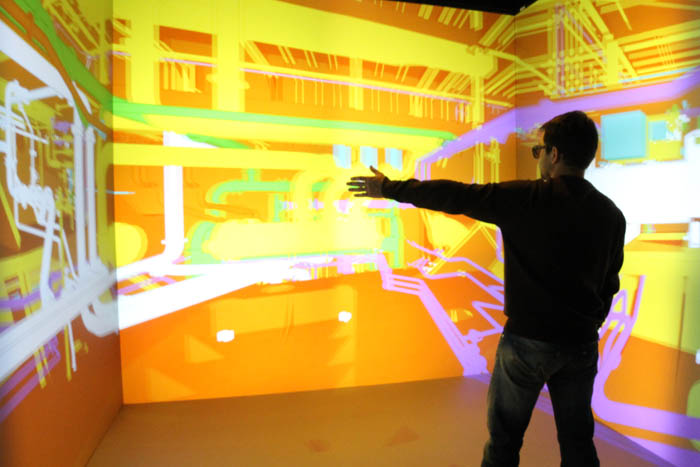
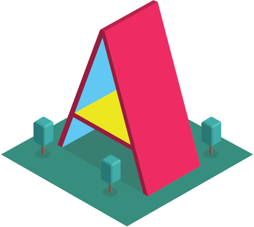

<!-- .slide: data-background="media/img/TACC_Slide.png" class="dark-text center" -->

<div class="slide__title">
  <h1>A-Frame</h1>
  <p>A web framework for building Virtual Experiences</p>
  <p>
    Andrew Solis | TACC
	<br/>
    Brian McCann Ph.D. | TACC
  </p>
  <p>
    https://github.com/andrewsolis/aframe-lecture
  </p>
</div>

<!-- NOTES -->
- I've taken these notes from the a-frame presentation, however I've augmented it as a lot of what they describe can be used for other implementations which I'll go over
- Explain to folks the growing area of different realities and how they can be used in a research environment
- Introduction into A-frame, what it is and how it can be used
- End with workshop where users will be able to build their own A-frame scene
- If you would like to see the originial slides please check out my github

------
<!-- .slide: data-background="media/img/TACC_Slide.png" class="dark-text center-custom" -->

<h3>Virtual Landscape Today</h3>

<div class="image-row">
  <div></div>
  <div></div>
  <div></div>
  <div></div>
  <div></div>
</div>
<div class="image-row">
  <div></div>
  <div></div>
  <div></div>
</div>

<!-- NOTES -->
- There have been recent advancements to deliver virtual experiences and content to the general public in the past decade
- Companies are promoting new technologies to deliver these experiences such as with the Oculus, HTC VIVE, Microsoft Hololens, etc.
- Companies are also investing into creating applications and SDK packages as a means for users to create their own virtual experiences for any device
  ex. Apple, Google, Unity3D
- While their is a large presence of this technology in the video game industry, research has long used these technologies
---
<!-- .slide: data-background="media/img/TACC_Slide.png" class="dark-text center-custom" -->

## Virtual Reality for Research

<div class="image-row">
  <div></div>
  <div></div>
  <div></div>
</div>

<!-- NOTES -->
- Virtual Reality has been used for medical training of surgeons to be better prepared for real life surgeries
- VR has also been used as a form of therapy for PTSD for veterans and to reduce a persons phobia 
- CAVE's have been used since the early 90's as a form of total immersion of a user and has been used
  for simulations, investigating Scientific Visualization, and Human Data Interaction analysis
- It is only natural that researchers continue to use these emerging technologies to see if and how they 
  can improve their research. But what are these technologies really?

---

<!-- .slide: data-background="media/img/TACC_Slide.png" class="dark-text center-custom" -->

## Different Realities

### Virtual 
### Augmented
### Mixed

<!-- NOTES -->
- Does anybody know the difference between Virtual, Augmented, and Mixed Reality?
- These systems are defined by research papers, industry phrasing, and individual interpretation so no clear definition, but there is a general understanding of each other and how they relate
- Let's take a look at how each of these is defined

---

## Virtual Reality

<!-- .slide: data-background-video="media/video/virtualreality.mp4" data-background-video-loop="true" data-background-video-muted="true" data-state="state--bg-dark" -->

<!-- NOTES -->
- Virtual reality is a technology platform that transports the viewer to immersive 3D environments
- users can interact both with the environment and content
- Can involve using a head-mounted display
- Examples include: HTC VIVE, Oculus, Google Daydream/Cardboard 

---
<!-- .slide: data-background-video="media/video/newyorker_gif.mp4" data-background-video-loop="true" data-background-video-muted="true" data-state="state--bg-dark" -->

## Augmented Reality


<!-- NOTES -->
- Augmented Reality overlays digital information over real world elements
- Information is provided for real world elements to the viewer, which can be as simple
  as text or complicated as a simulation 
- The information provided to the user does not emulate real world objects
- Noticeable examples of hardware and techology include HUD (FPS video game), Google Glass
- Usecases are field workers such as folks in construction of engineering relaying information back
  based off what the system is viewing
---

## Mixed Reality

<!-- .slide: data-background-video="media/video/elephant.mp4" data-background-video-loop="true" data-background-video-muted="true" data-state="state--bg-dark" -->

<!-- NOTES -->
- Mixed reality bring together real world and digital elements
- mixed Reality merges virtual elements into the physical world to look as if they are
  really there, and interact in real time
- Notable examples: Microsoft Hololens, Magic Leap, Meta2
---

<!-- .slide: data-background="media/img/TACC_Slide.png" class="dark-text center-custom" -->

<h4 class="margin-custom">
Hardware Ecosystem
</h4>

<div class="image-row">
    <div></div>
    <div></div>
    <div></div>
</div>

<div class="image-row">
  <div></div>
  <div></div>
  <div></div>
</div>

<!-- NOTES -->
- Range from cheap to expensive, tethered and untethered, controllers, tracking
- Different devices for different purposes, some overlap on use cases
- CAVE2 was developed by the Electronic Visualization Laboratory (EVL) at the University of Illinois at Chicago (UIC)
  (think CAVE but with monitors instead of projections)
- This also doesn't include custom made systems made by industry or research organizations

---

<!-- .slide: data-background="media/img/TACC_Slide.png" class="dark-text center-custom" -->


<h4 class="margin-custom">
Software Ecosystem
</h4>

<div class="image-row">
    <div></div>
    <div></div>
    <div></div>
</div>
<div class="image-row">
    <div></div>
    <div></div>
    <div></div>
</div>
<div class="image-row">
    <div></div>
    <div></div>
    <div></div>
</div>


<!-- NOTES -->
- There are many possible ways for you to create virtual content
- Unity and Unreal are some of the biggest players in the business
- Vuforia used with unity to create AR applications easy
- Popular AR SDK's available by Google and Apple
- A-frame popular for web developers, though you don't have to be one
- Used in Research realm as well. Kitware has added a way to visualize
    data in vtk with VR headsets, and created builds of Paraview to do this
- UCSF (Calif. San Fran.) developed ChimeraX for interactive molecular
    visualization tools
- My goal is not to say which one is best, but rather show you
    how easy it is to create a virtual experience using a technology
    I am familiar with
- Depending on what you are doing can affect your choices for software
    and systems.
- Let's take a look exactly at what A-frame is and how it works...
------

# A-Frame

<!-- .slide: data-background="media/img/aframe-rendered-full.png" -->

A web framework for building virtual content and experiences

<!-- NOTES -->
- Launched in December 2015
Goals of A-Frame:
  - Easy for web developers to create VR content, without graphics knowledge
  - Prototype and experiment WebVR and VR UX faster
  - Vehicle to kickstart WebVR ecosystem
  - Started as a technology for VR experiences but now changing to support
    all types of virtual content

---

## HTML
<!-- .slide: data-background="media/img/aframe-rendered-full.png" -->

```html
<!DOCTYPE html>
<html>
<body>

<h1>My First Heading</h1>
<p>My first paragraph.</p>

</body>
</html>
```
<!-- NOTES -->
Standard markup language where you embed elements inside of each other to display
- Example: header tag, main html tag, a header and a paragraph
How are we able to immeiately interact with virtual interfaces?

---

<!-- .slide: data-background="media/img/aframe-rendered-full.png" -->


Browser APIs that enable WebGL rendering to headsets and access to VR
sensors

https://w3c.github.io/webvr/

> **API** : A set of routines, protocols, and tools for building software applications

<!-- NOTES -->

WebGL:
- A JavaScript API for rendering interactive 3D and 2D graphics
    within any compatible web browser


API:
- Optimized rendering path to headsets
- Access position and rotation (pose) data

History:
- Initial WebVR API by Mozilla
- Working W3C community group

Not just a specification, it's implemented...
---

<!-- .slide: data-background="media/img/aframe-rendered-full.png" -->

## A-Frame Technologies

<div class="image-row">
    <div></div>
    <div></div>
    <div></div>
</div>

<!-- NOTES -->
Core technologies used for A-Frame
* We won't go into these in detail and will mostly be learning A-Frame, but this
    helps give you a sense of how it works and what it takes care of
* If you find yourself interested later on then you have the option to customize
    any level of the pipeline as you wish
Let's take a look at some exammples.
---

## Hello World

<!-- .slide: data-background="media/img/aframe.jpg" data-transition="slide-in none" -->

```html
<html>
  <script src="https://aframe.io/releases/0.8.2/aframe.min.js"></script>
  <a-scene>


  </a-scene>
</html>
```
<!-- .element: class="stretch" -->

<!-- NOTES -->
- Just HTML
- Drop a script tag, no build steps
- Using Custom HTML Elements
- One line of HTML `<a-scene>` handles
  - canvas, camera, renderer, lights, controls, render loop, WebVR polyfill, VREffect
- Take for granted the fact that it handles all of these options for you which you
  can customize later
- Put stuff inside our scene...
---

## Hello World

<!-- .slide: data-background="media/img/aframe.jpg" data-transition="fade-in slide-out" -->
```html
<html>
  <script src="https://aframe.io/releases/0.8.2/aframe.min.js"></script>
  <a-scene>
    <a-box  color="#4CC3D9" position="-1 0.5 -3" rotation="0 45 0"></a-box>
    <a-cylinder color="#FFC65D" position="1 0.75 -3" radius="0.5" height="1.5"></a-cylinder>
    <a-sphere color="#EF2D5E" position="0 1.25 -5" radius="1.25"></a-sphere>
    <a-plane color="#7BC8A4" position="0 0 -4" rotation="-90 0 0" width="4" height="4"></a-plane>
    <a-sky color="#ECECEC"></a-sky>
  </a-scene>
</html>
```
<!-- .element: class="stretch" -->

<!-- NOTES -->
- Basic 3D primitives with Custom Elements
- Quickly look at a our example...
---

## Hello World

<!-- .slide: data-background="media/img/aframe.jpg" data-transition="fade-in slide-out" -->

<div class="stretch" data-aframe-scene="scenes/hello-world.html"></div>

<h3> http://www.aframe.io </h3>
<!-- NOTES -->
Simple scene that is able to be ran on mobile phone and headset if available
- Try going to aframe website at link above and see for yourself the same scene
---

<!-- .slide: data-background="media/img/aframe.jpg" -->

## Works With other web technologies

<div class="captioned-image-row">
  <div>
    
    <i>d3.js</i>
  </div>
  <div>
    
    <i>Vue.js</i>
  </div>
  <div>
    
    <i>React</i>
  </div>
  <div>
    
    <i>Redux</i>
  </div>
  <div>
    
    <i>jQuery</i>
  </div>
  <div>
    
    <i>Angular</i>
  </div>
</div>

<!-- NOTES -->

- Based on HTML, compatible with all existing libraries/frameworks
- Good reason to have HTML as an intermediary layer between WebGL/three.js
- All tools were on top of the notion of HTML
- Under the hood, A-Frame is an extensible, declarative framework for three.js...
- Let's take a peek at how A-frame works under the hood....
------

# Entity-Component-System

<!-- .slide: data-background="media/img/minecraft-blocks.png" -->

<!-- NOTES -->
- Is an entity-component framework
- Popular in game development
- All objects in scene are **entities** that inherently empty objects. Plug in
    **components** to attach appearance / behavior / functionality
- 2D web, elements laid out have fixed behavior
- 3D/VR objects of infinite types and complexities, so this is an easy way to build up different kinds of objects

---

<!-- .slide: data-background="media/img/minecraft-blocks.png" data-transition="slide-in none" -->

## Composing an Entity

```html
<a-entity>
</a-entity>
```

<!-- .element: class="stretch" -->

<!-- NOTES -->
- Start with an `<a-entity>`
- By itself, has no appearance, behavior, functionality
- Plug in components to add appearance, behavior, functionality

---

## Adding appearance

<!-- .slide: data-background="media/img/minecraft-blocks.png" data-transition="none" -->

```html
<a-entity
    geometry="primitive: cylinder; radius: 1.5; height: 2;"
    material="color: #B96FD3; roughness: 0.4">
</a-entity>
```

<div class="stretch" data-aframe-scene="scenes/composing-entity-1.html"></div>

<!-- .element: class="stretch" -->

<!-- NOTES -->
- Syntax similar to CSS styles
- Component names as HTML attributes
- Component properties and values as HTML attribute value
- If you haven't used CSS or HTML then you can think about it as defining parameters
    of an object. Here we are defining the geometry of our entity, and it's material  
- Giving it a color in hexadecimal format but can also use rgb
- roughness is used to define how the material scatters light. A rougher material (1.0)
    will reflect light in more directions
- units in a-frame are in meters
---

## Changing appearance

<!-- .slide: data-background="media/img/minecraft-blocks.png" data-transition="none" -->

```html
<a-entity
    geometry="primitive: cylinder;  height: 3; radius: 1.5;"
    material="color: #B96FD3; roughness: 0.4"
    position="-1 2 -6" rotation="45 0 90" scale="2 2 2">
</a-entity>
```

<div class="stretch" data-aframe-scene="scenes/composing-entity-2.html"></div>

<!-- .element: class="stretch" -->

<!-- NOTES -->

Can add more specifications such as the position of our element in our scene,
if we'd like to rotate it and about which axes, and if we'd like to scale it
- All of these attributes are mapped to x, y, and z coordinates respectively

---

## Adding Behavior

<!-- .slide: data-background="media/img/minecraft-blocks.png" data-transition="none" -->

```html
<a-entity
    geometry="primitive: cylinder; height: 2; radius: 1.5"
    material="color: #B96FD3; roughness: 0.4"
    position="-1 2 -6" rotation="45 0 90" scale="2 2 2"
    animation="property: rotation; loop: true; to: 45 360 90">
```

<div class="stretch" data-aframe-scene="scenes/composing-entity-3.html"></div>

<!-- .element: class="stretch" -->

<!-- NOTES -->
* Here I am telling the object to perform an animation (which is rotate in this example)
    and setting other possible paraters such as if I'd like it to loop, what the final
    value should be after rotation, etc.
* You can control a lot of different elements of an object and add multiple animations,
    but this is a simple way of understanding how to create simple actions for your events

What if I wanted to load a model from a file?

---

## Loading an Object

<!-- .slide: data-background="media/img/minecraft-blocks.png" data-transition="none" -->

```html
    <a-assets>
        <a-asset-item id="bb8-json" src="../materials/bb-unit-threejs/bb-unit.json"></a-asset-item>
    </a-assets>
    <a-entity
        object-model= "src: #bb8-json"
        position="0 1 -3" rotation="0 0 0" scale="0.01 0.01 0.01">
    </a-entity>
```

<div class="stretch" data-aframe-scene="scenes/loading-object.html"></div>

<!-- .element: class="stretch" -->

<!-- NOTES -->
- I have a predefined object in a json file that I define inside an a-asset-item tag
    (you can use this to keep track of all the assets in your scene)
- I reference my object file later to load, and change some parameters of it

What about having my object perform some action?
How could I write my own component?

---
## Writing a Component

<!-- .slide: data-background="media/img/minecraft-blocks.png" data-transition="none" -->

```js
AFRAME.registerComponent('my-component', {
  schema: {
    foo: {type: 'selector'},
    bar: {default: 256}
  },

  init: function () { // ... },
  update: function () { // ... },
  remove: function () { // ... },
  tick: function () { // ... }
});
```
<!-- .element: class="stretch" -->

```html
<a-box my-component="foo: #box; bar: 300"></a-box>
```

<!-- NOTES -->
- 'my-component': name of attribute to use to attach to a-frame entity
- `schema`: defines how data is parsed from HTML
- Lifecycle methods:
  - `init`: component attached, like `componentDidMount`
  - `update`: component data update, like `componentWillReceiveProps`
  - `remove`: component detached, like `componentWillUnmount`
  - `tick`: run on every frame

---

<!-- .slide: data-background="media/img/standard-components.png" data-background-size="contain" -->

<!-- NOTES -->
- These are some components that ship with A-Frame
- A-Frame is fully extensible at its core so...

---

<!-- .slide: data-background="media/img/community-components.png" data-background-size="contain" -->

<!-- NOTES -->
- Community has filled the ecosystem with tons of components
- Components can do whatever they want, have full access to three.js and Web APIs
- The component ecosystem the lifeblood of A-Frame
- Physics, leap motion, particle systems, audio visualizations, oceans
- Drop these components as script tags and use them straight from HTML
- Advanced developers empowering other developers
- Working on collecting these components...

---

# Registry

<!-- .slide: data-background-color="#333" -->

Curated collection of A-Frame components.

<a class="stretch" href="https://aframe.io/aframe-registry">
  <video loop data-src="media/video/registrypreview.mp4" data-autoplay></video>
</a>

<!-- NOTES -->
- Collecting them into the A-Frame registry
- Like a store of components that we make sure work well
- People can browse and search for components or install them....

---

## Inspector

<!-- .slide: data-background="media/img/inspector.png" data-state="state--bg-dark" -->

Visual tool for A-Frame. Just `<ctrl>+<alt>+i`.

<div class="stretch" data-aframe-scene="scenes/80s.html"></div>

------

<!-- .slide: data-background="media/img/header.png" -->

# Community

https://aframe.io/blog/

---

<!-- .slide: data-background="media/img/adit.gif" -->

# Data Visualization - *Adit*

@datatitian

---

<!-- .slide: data-background="media/img/math.gif" -->

# Mathematics - *MathworldVR*

@sleighdogs

---

<!-- .slide: data-background="media/img/cadavr.gif" -->

# Education - *CadaVR*

@drryanjames

---

<!-- .slide: data-background="media/img/apainter.gif" -->

# Art - *A-Painter*

@mozillavr

---

<!-- .slide: data-background="media/img/mars.jpg" -->

# Journalism - *Journey to Mars*

The Washington Post

---

<!-- .slide: data-background="media/img/ar.gif" -->

# AR - *AR.js + A-Frame*

@jerome_etienne

---

# aframe.io

<div class="captioned-image-row">
  <div>
    
    <i>180+ contributors 6000+ Stargazers</i>
  </div>
  <div>
    
    <i>4000+ members on Slack</i>
  </div>
  <div>
    
    <i>100s of featured projects</i>
  </div>
</div>

<!-- NOTES -->
- Open source and inclusive project
- Most work done on GitHub
- Active community on Slack to share projects, interact, hang out, seek help
- Featured projects on the `awesome-aframe` repository and *A Week of A-Frame* blog

------

#References
<div class="references">
  <ol>
    <li>
      Ngo, Kevin, and Marcos Diego. "A-Frame Presentation" _aframe.io_ Mozilla Corporation. n.d. Web. 15 June 2017. <https://aframe.io/aframe-presentation-kit/#/>.
    </li>
    <li>
      Vaughn, Matthew, Ph.D. "A-frame Presentation." _Heroku_. TACC, n.d. Web. 15 June 2017. <http://cshl-aframe.kybernet.es/index.html#/>.
    </li>
    <li>
      Jones, Brandon. "WebVR Explained". _Github_ W3C. n.d. Web. 15 June 2017. <https://github.com/w3c/webvr/blob/master/explainer.md>.
    </li>
    <li>
      Tutorialspoint.com "WebGl Cube Rotation." _Tutorialspoint_ N.p., n.d. Web. 15 June 2017. <https://www.tutorialspoint.com/webgl/webgl_cube_rotation.htm>.
    </li>
    <li>
      Petitcolas, Jonathan. "Create a Rotating Cube in WebGL with Three.js." _jonathan-petitcolas_ N.p., n.d. Web. 16 June 2017. <https://www.jonathan-petitcolas.com/2013/04/02/create-rotating-cube-in-webgl-with-threejs.html>.
    </li>
    <li>
      Ngo, Kevin, and Po-chiang Chao. "An Interactive Course for WebVR." _aframe.io_ Mozilla Corporation, n.d. Web. 16 June 2017. <https://aframe.io/aframe-school/#/>.
    </li>
    <li>
    "A-frame Documentation." _aframe.io_ Mozilla Corporation, n.d. Web. 16 June 2017. <https://aframe.io/docs/0.5.0/introduction/>.
    </li>
  </ol>
</div>
---
#References (continued)
<div class="references">
  <ol start="8">
    <li>
    "Getting Started with HTML." _developer.mozilla.org_ Mozilla Corporation, n.d. Web. 16 June 2017. <https://developer.mozilla.org/en-US/docs/Learn/HTML/Introduction_to_HTML/Getting_started>.
    </li>
    <li>
      Anatomy-of-an-html-element. Digital image. _mdn.mozillademos.org_ Mozilla Corporation, n.d. Web. 16 June 2017. <https://mdn.mozillademos.org/files/7659/anatomy-of-an-html-element.png>.
    </li>
    <li>
      Grumpy-cat-small. Digital image. _mdn.mozillademos.org_ Mozilla Corporation, n.d. Web. 16 June 2017. <https://mdn.mozillademos.org/files/9347/grumpy-cat-small.png>
    </li>
    <li>
      Jones, Brandon. "WebVR Explained". _Github_ W3C. n.d. Web. 15 June 2017. <https://github.com/w3c/webvr/blob/master/explainer.md>.
    </li> 
    <li>
        Larsen, Christian R and Soerensen, Jette L and Grantcharov, Teodor P and Dalsgaard, Torur and Schouenborg, Lars and Ottosen, 
        Christian and Schroeder, Torben V and Ottesen, Bent S. "Effect of virtual reality training on laparoscopic surgery: randomised controlled trial"
        _BMJ_ BMJ Publishing Group Ltd. **10.1136/bmj.b1802** <https://www.bmj.com/content/338/bmj.b1802>
    </li>
    <li>
        HOFFMAN, HUNTER G. “VIRTUAL-REALITY THERAPY.” _Scientific American_, vol. 291, no. 2, 2004, pp. 58–65. _JSTOR_, JSTOR <http://www.jstor.org/stable/26060647>
    </li>
  </ol>
</div>

---
#References (continued)
<div class="references">
    <ol start="14">
        <li>
            Thomas D. Parsons, Albert A. Rizzo. "Affective outcomes of virtual reality exposure therapy for anxiety and specific phobias: A meta-analysis" _Journal of Behavior Therapy and Experimental Psychiatry_, vol 39, Issue 3, 2008, pp. 250-261. <https://doi.org/10.1016/j.jbtep.2007.07.007>
        </li>
        <li>
            Carolina Cruz-Neira, Daniel J. Sandin, and Thomas A. DeFanti. 1993. "Surround-screen projection-based virtual reality: the design and implementation of the CAVE." _In Proceedings of the 20th annual conference on Computer graphics and interactive techniques_ (SIGGRAPH '93). ACM, New York, NY, USA, 135-142. DOI: <https://doi.org/10.1145/166117.166134>
        </li>
        <li>
            "Demystifying the Virtual Reality Landscape" _intel.com_ Intel. Web. July 24, 2018.
            <https://www.intel.com/content/www/us/en/tech-tips-and-tricks/virtual-reality-vs-augmented-reality.html>
        </li>
        <li>
            Johnson, E. "What are the differences among virtual, augmented and mixed reality?" _recode.net_ Recode. Web
            July 24, 2018. <https://www.recode.net/2015/7/27/11615046/whats-the-difference-between-virtual-augmented-and-mixed-reality>
        </li>
    </ol>
</div>
